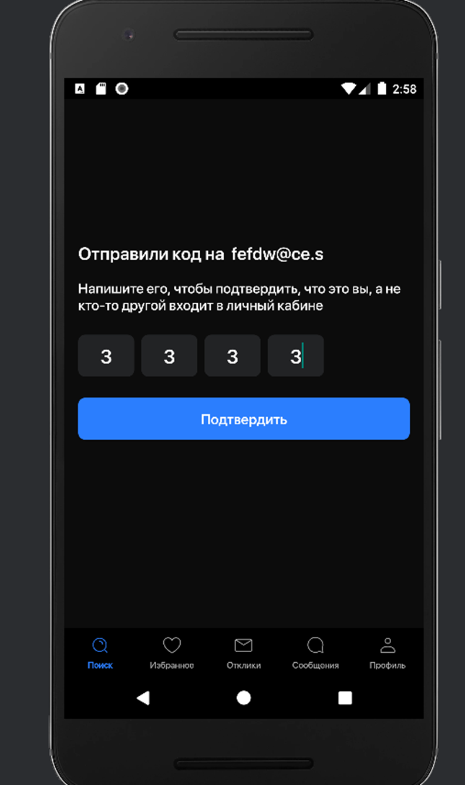

# HhClon
## This project was done as a test task (Note: API is mock, there was not provided api so here is imitated api response)
The project was completed in a limited time using the best practices
# Screenshots

   

   

   

    

Installation
Include steps or commands to install and set up the project. For example:
    

        <h3>1. Clone the repository: git clone https://github.com/Mixail445/HhClone</h3>
    

    

        <h3>2. Install dependencies</h3>
    

